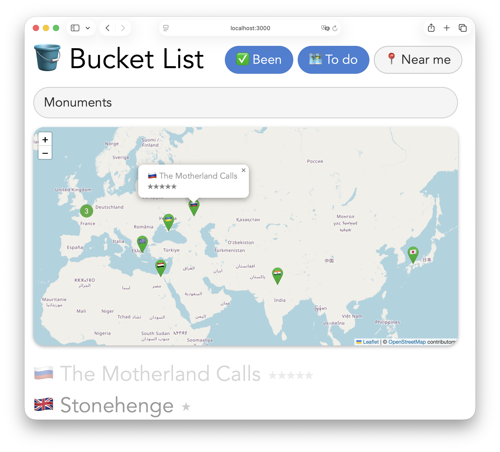

# AI ❤️ Databases, for everyone!

## 5. Natural language search

> You mentioned something about natural language search. How does that work?

Great question — this is where things get genuinely magical, and I want to explain it properly because it's one of those ideas that sounds complicated but clicks immediately once you see it.

Let me start with an analogy. When you're looking for a house, you're not just searching one dimension — you're navigating a space of dozens of overlapping qualities: location, size, natural light, walkability, character, garden, proximity to good schools, whether the kitchen *feels* right. No single number captures any of those things, and yet somehow your brain weighs them all simultaneously and knows when something fits.

Language works the same way. The word "dangerous" is close to "risky" and "hazardous," but also close to "exciting" and "thrilling" in a different direction. "Remote" is close to "isolated" but also close to "peaceful" and "unspoiled." These relationships exist in many dimensions at once.

What AI language models have learned to do is map words, sentences, and paragraphs onto points in one of these high-dimensional spaces. The mapping is called an **embedding** — a long list of numbers that represents the *meaning* of a piece of text as a location in that space. Things that mean similar things end up near each other. Things that mean different things end up far apart.

So here's how we use that for your bucket list. We take a few paragraphs from each Wikipedia article and convert them into embeddings using an AI model. We store those embeddings in MongoDB alongside the rest of your data. Then when you type a search query, we convert *that* into an embedding too and ask MongoDB to find the documents whose embeddings are closest to it in that space.

That's it. You're not searching for words — you're searching for meaning.

> How many dimensions are we talking about?

OpenAI's embedding model produces vectors with **512 dimensions** in our configuration. So each of your 96 places gets represented as a list of 512 floating point numbers. MongoDB stores all of them, and when you search, it computes the distance between your query vector and every stored vector and returns the closest ones.

> Okay, so how do we set it up?

Two steps. First, a script that reads the Wikipedia article for each place, pulls out a few paragraphs as a summary, and generates an embedding. It stores both back in the database — the summary as readable text, the embedding as that array of numbers.

You'll need an OpenAI API key for this. If you don't have one, head to [platform.openai.com/api-keys](https://platform.openai.com/api-keys), create a free account, and generate a new key. The embeddings are very cheap — a fraction of a cent for all 96 entries. Add the key to your `.env` file:

```
OPENAI_API_KEY=sk-...your key here...
```

Then in the scripts folder:

```bash
npm install
node add-embeddings.mjs
```

It'll work through all 96 entries, logging each one as it goes. Takes a few minutes.

> Okay, it's running! While that's going — what's the second step?

The second step is telling MongoDB to build a **Vector Search index** on the embedding field. This is what lets it search efficiently across 512 dimensions rather than doing brute-force comparisons.

Log into Atlas, click on your cluster, then go to **Atlas Search → Create Search Index → Atlas Vector Search**. Select the `everyone` database and `bucket` collection, and use this index definition:

```json
{
  "fields": [
    {
      "type": "vector",
      "path": "wikiEmbedding",
      "numDimensions": 512,
      "similarity": "cosine"
    }
  ]
}
```

The `numDimensions` must match what we generated. The `similarity` metric `cosine` measures the angle between vectors rather than raw distance, which works better for comparing meaning. Hit Create and Atlas builds the index in the background — usually about a minute.

> The script finished and the index is ready! Now what?

Now add your OpenAI key to the website's `.env` file as well, run `npm install` in the website folder to pick up the new package, and restart the server. You'll see a search box has appeared at the top of the page. Try typing something.



> Okay, I see the search field! I typed "statues" and it found The Motherland Calls, Worker and Kolkhoz Woman, and Woinic. Then I typed "transit" and it found ten metro, tram and train related things from around the world. This is so amazing! And run this by me again... all of this works because of 512 inscrutable numbers?!

Yes! 512 numbers per document — and the magic is entirely in *which* 512 numbers. They're the output of a model trained on essentially all of human writing, which learned to compress meaning into geometry. Synonyms end up in the same neighborhood. Concepts that often appear together end up nearby. Things that are semantically opposite end up far apart.

When you searched "statues," the model converted that word into its own point in the space. Then MongoDB measured the distance from that point to all 95 document vectors and returned the closest ones. The Motherland Calls, Worker and Kolkhoz Woman, and Woinic are all giant public sculptures — the model knew that, not because anyone told it, but because their Wikipedia summaries use language that clusters near the language around "statues."

> So it's not just keyword matching?

Not at all. If it were keyword matching, you'd only get results where the word "transit" literally appears in the summary. Vector search finds conceptual relatives. The Belgian Coast Tram might be described as a "coastal railway" with no mention of the word "transit" anywhere, and it still surfaces because *tram* and *railway* and *transit* live in the same neighborhood of the space.

That's why the search feels intelligent rather than mechanical. You're not searching text — you're searching *meaning*. And you built it entirely on top of data you already had. The Wikipedia summaries and embeddings were the only new ingredient.

---

*Next: [Chat](chat.md) — build a chatbot that can answer questions about your data.*
